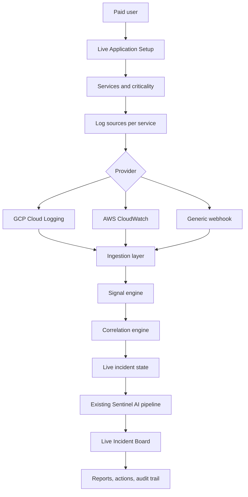

# Live Incident Enterprise Architecture

## Goal

Live Incident should evolve from a single CloudWatch log watcher into an application-aware monitoring surface for paid users. Enterprise teams usually run one business system as many microservices, so Sentinel should let a user define a business application, attach 10-15 services, connect each service to logs, then correlate signals into one incident instead of opening noisy, disconnected alerts.

## Target Architecture

## Core Concepts

- **Live Application**: A monitored business system, such as `Fintech Switching Platform - production`.
- **Live Service**: A microservice inside the application, such as `auth-service`, `ledger-service`, or `settlement-worker`.
- **Live Log Source**: A provider-specific log stream or query attached to one service.
- **Signal**: A small structured detection, such as `timeout_spike`, `database_error`, or `auth_failure_burst`.
- **Correlated Incident**: One live incident created from related signals across multiple services.

## Runtime Flow

1. A paid user creates a Live Application.
2. The user adds the microservices that make up that application.
3. Each service gets one or more log sources, starting with CloudWatch compatibility and GCP Cloud Logging readiness.
4. Sentinel collects or receives logs and converts noisy records into structured signals.
5. The correlation engine groups related service signals by time window, application, service dependency, and error fingerprint.
6. Sentinel opens or updates one Live Incident and sends a concise incident packet into the existing AI pipeline.
7. The Live Board shows application health, affected services, evidence, RCA, and recommended actions.

## Phase Plan

### Phase 1: Application-Aware Configuration

Add data model, API, and UI for:

- live applications
- services under each application
- log sources under each service

This phase keeps the existing CloudWatch polling flow intact.

### Phase 2: Provider-Agnostic Ingestion

Add a normalized ingestion contract so logs can arrive from:

- GCP Cloud Logging via Pub/Sub
- AWS CloudWatch
- generic webhook payloads

Implemented ingestion surfaces:

- `POST /api/live/ingest`: authenticated paid-user endpoint for normalized log records.
- `POST /api/live/ingest/gcp-pubsub`: service-token endpoint for GCP Cloud Logging Pub/Sub push messages.

The service-token endpoint requires `X-Sentinel-Live-Token` and compares it to `LIVE_INGEST_TOKEN`. The GCP deployment stores this value in Secret Manager and injects it into Cloud Run.

Phase 2 stores raw normalized events in `live_log_events` and creates lightweight rows in `live_signals`. The signal layer is intentionally cheap and rule-based; later phases correlate these signals before deciding whether to create or update an AI-analyzed incident.

### Phase 3: Signal Engine

Convert raw logs into structured signals before running AI. This keeps cost low and reduces noise.

Implemented Phase 3 correlation behavior:

- Recent `live_signals` are evaluated per live application.
- Sentinel opens or updates one `live_incidents` row when:
  - at least two recent signals affect at least two services, or
  - any recent signal is critical.
- The correlated incident packet is written as structured log-like text and sent through the existing incident/job pipeline.
- `POST /api/live/applications/{application_id}/correlate` manually triggers correlation.
- `GET /api/live/applications/{application_id}/signals` returns current signal status for future UI surfaces.

### Phase 4: Cross-Service Correlation

Group related signals into one incident using application id, time window, service relationships, trace/request ids, and normalized error signatures.

### Phase 5: Live Board Upgrade

Replace the log-list-first board with an application health view:

- application status
- service status map
- suspected source service
- affected downstream services
- evidence by service
- timeline and AI remediation

## Backward Compatibility

The current `live_monitor_configs.log_groups_json` approach remains valid. Existing users can keep using the legacy CloudWatch log group list while the new application/service/source model is introduced. Later migration can convert legacy log groups into a default application with one log source per service.
